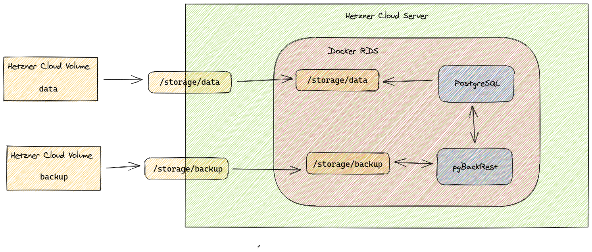

# Hetzner RDS Postgres

An often overlooked alternative to the big players in the cloud market is the [Hetzner Cloud](https://www.hetzner.com/de/cloud), developed by the well known German hosting company Hetzner. 

Of course, it can't compete with the 2 gazillion services from AWS but it doesn't need to, because it already contains the basic building blocks for deploying scalable applications.. Namely, an equivalent for EC2, VPC, ALB, and EBS. What's missing though is a replacement for RDS which makes it difficult to run any application that stores state in an SQL database.

In this blog post we will try to replicate this service on our own, based on the building blocks provided by the Hetzner Cloud. Due to the imminent hybris and madness in the IT sector, we will call this service RDS (please AWS don't sue me) because the acronym fits the purpose of this service the best.

We can't compete with dozens of AWS engineers and replicate all variants of RDS. Instead we will focus on PostgreSQL as database backend and also skip the multi zone/master implementation. To optimize for MTTR instead of MTBF we aim for a solid backup and recovery strategy. 

# Architecture

Here is a quick overview of what we are about to build:



## Storage

Two data volumes will serve as our storage backend, where one will host the actual database files from PostgreSQL and the other the backup archives. This not only helps with performance, but gives us some flexibility on storage provisioning, because at a later stage we might want to migrate the data partition to local NVMe SSD storage for performance reasons.

The storage is mounted on the server and again mounted into the docker container via a docker bind mount.

## Docker

The PostgreSQL server will be packaged in docker which makes the deployment easier,  more predictable, and also helps us to test our solution locally. All configuration is done by setting environment variables, that can be used in configuration files that are rendered by [gomplate](https://gomplate.ca/) where needed.

## Backup

The backup and restore duty will be fulfilled by [pgBackRest](https://pgbackrest.org/) offering full, differential and incremental backups for PostgreSQL databases, 
and also include WAL archiving which enables us to implement Point In Time recovery (PITR) if needed.

## Provisioning

As the Hetzner cloud offers an extensive [API](https://docs.hetzner.cloud/) for all their services, we can use terraform to provision all our needed cloud resources.

# Implementation

For the implementation part we will focus on the RDS-specific parts of our setup and not focus on all the nitty-gritty details of the glue code holding everything together (this will hopefully be part of a separate blog post in the future). A running example of everything explained in this post can be cloned from [https://github.com/pellepelster/hetzner-rds-postgres](https://github.com/pellepelster/hetzner-rds-postgres).

## Docker

First step, of course, is to install all required packages that we need to implement our envisioned functionality:

<!-- snippet:docker_install_packages -->
```
ENV DEBIAN_FRONTEND=noninteractive

RUN apt-get update && \
    apt-get dist-upgrade --assume-yes --quiet && \
    apt-get --assume-yes --quiet --no-install-recommends install \
    postgresql-11 \
    curl \
    ca-certificates \
    jq \
    uuid-runtime \
    pgbackrest \
    libdbd-pg-perl \
    libpq-dev
```

<!-- /snippet:docker_install_packages -->

Being responsible developers, we always verify the checksums of the static binaries used to distribute golang based software, in this case the template renderer gomplate:  

<!-- snippet:docker_install_gomplate -->
```
RUN curl -L -o /usr/local/bin/gomplate https://github.com/hairyhenderson/gomplate/releases/download/${GOMPLATE_VERION}/gomplate_linux-amd64-slim && \
    echo "${GOMPLATE_CHECKSUM}" /usr/local/bin/gomplate | sha256sum -c && \
    chmod +x /usr/local/bin/gomplate
```

<!-- /snippet:docker_install_gomplate -->

Of course we won't run everything as root inside docker container, as this may lead to security issues in the future. Instead, we create a dedicated user. The important part here is we use a static predefined user and group id (the number 4000 is arbitrarily picked) to circumvent permission issues that we may run into when mounting directories from the host system. 

<!-- snippet:docker_user -->
```
RUN groupadd --gid "${USER_GID}" "${USER}" && \
    useradd \
      --uid ${USER_ID} \
      --gid ${USER_GID} \
      --create-home \
      --home-dir /${USER} \
      --shell /bin/bash \
      ${USER}
```

<!-- /snippet:docker_user -->

The main configuration of the PostgreSQL instance is done via environment variables, namely `${DB_INSTANCE_ID}` which is a unique identifier for the database instance, and of course a password, provided by `${DB_PASSWORD}`. The name of the database schema and username defaults to the value of `${DB_INSTANCE_ID}` and can be overridden by `${DB_DATABASE}` and `${DB_USERNAME}` respectively.

## run.sh

Finally, the Dockerfile hands off control to the `/rds/bin/run.sh` where we will configure and start the PostgreSQL server. 

### Templates

First order of business is to render the template files for the PostgreSQL and pgBackRest configuration and some helper scripts. During the template run all environment variable placeholders will be replaced with the actual runtime content of the variables:

<!-- snippet:run_gomplate -->
```
gomplate --input-dir /rds/templates/config --output-dir /rds/config
gomplate --input-dir /rds/templates/bin --output-dir /rds/bin
```

<!-- /snippet:run_gomplate -->

The `pgbackrest.conf` is a straightforward adaption of the example from the [pgBackRest User Guide](https://pgbackrest.org/user-guide.html) where we configure the directory that holds the backup files, and our db instance that should be backed up (later referred to as stanza, as it is called in the pgBackRest world). 

<!-- file:templates/config/pgbackrest.conf -->
```
[global]
repo-path={{ .Env.BACKUP_DIR }}/{{ .Env.DB_INSTANCE_ID }}

[{{ .Env.DB_INSTANCE_ID }}]
pg1-path={{ .Env.INSTANCE_DATA_DIR }}
pg1-socket-path=/rds/socket

```

<!-- /file:templates/config/pgbackrest.conf -->

The `postgresql.conf` itself is also pretty basic, most important aspect is that we use pgBackRest as archive command for storing the databases [WAL files](https://en.wikipedia.org/wiki/Write-ahead_logging) which will enable pgBackRest to restore the database up to the point of the last archived WAL file:

<!-- file:templates/config/postgresql.conf -->
```
archive_command = 'pgbackrest --config /rds/config/pgbackrest.conf --log-level-console=info --log-path=/rds/log --stanza={{ .Env.DB_INSTANCE_ID }} archive-push  %p'
archive_mode = on
max_wal_senders = 3
wal_level = replica
listen_addresses = '*'
unix_socket_directories =  '/rds/socket'

```

<!-- /file:templates/config/postgresql.conf -->

A small backup script that triggers the pgRestBackup backup is generated into `/rds/bin/backup.sh`. This file is intended to be called from the host system in order to trigger the database backup.

<!-- file:templates/bin/backup.sh -->
```
#!/usr/bin/env bash

set -o pipefail -o errexit -o nounset

pgbackrest --config /rds/config/pgbackrest.conf --log-level-console=info --log-path=/rds/log --stanza={{ .Env.DB_INSTANCE_ID }} backup --type=full
```

<!-- /file:templates/bin/backup.sh -->

### Server Start

Before we can start the server we have to think about some special cases concerning the data the server is supposed to work with. Depending on the lifecycle of our instance we have to deal with the following scenarios:

* Scenario 1: A freshly provisioned instance, data and backup directories are empty
* Scenario 2: An empty data dir (maybe due to data loss) and a backup directory containing backups
* Scenario 3: Data directory is not empty and the backup directory may or may not be filled with backups

#### Scenario 1

This scenario is relatively straightforward, we just have to initialize a fresh instance, create a database according to the environment variable configuration and create an initial backup:

The database initialization is done the same way as in any other PostgreSQL instance by calling `initdb`:

<!-- snippet:run_initdb -->
```
    ${POSTGRES_BIN_DIR}/initdb --username="rds" --encoding=UTF8 --pwfile=<(echo "${DB_PASSWORD}") -D "${INSTANCE_DATA_DIR}" || true
```

<!-- /snippet:run_initdb -->

To be able to create a database we have to start the instance. To avoid any unwanted connections to the database we override the `listen_addresses` configuration, setting it to an empty string. By doing this, the server will not bind to any interfaces and per configuration from above only allow socket-based communication. We will only allow non-local communication when the instance is finally configured and ready to accept external traffic:


<!-- snippet:run_init_start -->
```
    ${POSTGRES_BIN_DIR}/pg_ctl -D "${DATA_DIR}/${DB_INSTANCE_ID}" start --options="-c listen_addresses=''"
```

<!-- /snippet:run_init_start -->

Now that the server is running we can create the database:

<!-- snippet:run_create_db -->
```
    if [[ $(psql_count "SELECT count(datname) FROM pg_database WHERE datname = '${DB_DATABASE}';") == "0" ]]; then
        psql_execute "CREATE DATABASE ${DB_DATABASE}"
    fi
```

<!-- /snippet:run_create_db -->

and a user with permissions to access the just created database:

<!-- snippet:run_create_user -->
```
    if [[ $(psql_count "SELECT count(u.usename) FROM pg_catalog.pg_user u WHERE u.usename = '${DB_USERNAME}';") == "0" ]]; then
        psql_execute "CREATE USER ${DB_USERNAME} WITH ENCRYPTED PASSWORD '${DB_PASSWORD}'"
    fi

    psql_execute "GRANT ALL PRIVILEGES ON DATABASE ${DB_DATABASE} TO ${DB_USERNAME}"
```

<!-- /snippet:run_create_user -->

The last step in the initialization process is to create an initial backup, and stop the server, so it can be started with external connectivity later on:

<!-- snippet:run_init_finalize -->
```
    pgbackrest_execute --log-level-console=info backup

    ${POSTGRES_BIN_DIR}/pg_ctl -D "${INSTANCE_DATA_DIR}" stop
```

<!-- /snippet:run_init_finalize -->


#### Scenario 2

The case where we already have a valid data directory is a little bit easier to handle. We just have to start the server (again with the socket-only trick from scenario 1) and be sure to set the password for the database user, as it may have changed during restarts by providing a new value for the `${DB_PASSWORD}` environment variable. 

<!-- snippet:run_start_with_data -->
```
    ${POSTGRES_BIN_DIR}/pg_ctl -D "${INSTANCE_DATA_DIR}" start --options="-c listen_addresses=''"
    psql_execute "ALTER USER ${DB_USERNAME} WITH ENCRYPTED PASSWORD '${DB_PASSWORD}'"
    ${POSTGRES_BIN_DIR}/pg_ctl -D "${INSTANCE_DATA_DIR}" stop
```

<!-- /snippet:run_start_with_data -->

#### Scenario 3

Now the restore case is a little more delicate as we have to take some extra steps to make sure the restore is complete. First, we to actually restore the data from pgBackRest:

<!-- snippet:run_restore_restore -->
```
        pgbackrest_execute --db-path="${INSTANCE_DATA_DIR}" restore --recovery-option="recovery_end_command=/rds/bin/recovery_complete.sh"
```

<!-- /snippet:run_restore_restore -->

What the restore command also does, besides restoring the actual data, is to generate a recovery.conf` for PostgreSQL with instructions on how to restore the instance from the restored data (see [here](https://www.postgresql.org/docs/11/recovery-config.html) for more in-depth information about this process). We add a little customization to the process in form of a command that is triggered when the recovery is done. This command will just write a marker file so we know the recovery is complete, and looks like this:

<!-- file:bin/recovery_complete.sh -->
```
#!/usr/bin/env bash

set -o pipefail -o errexit -o nounset

echo "complete" > /rds/run/recovery_complete

```

<!-- /file:bin/recovery_complete.sh -->

Now when we start the server (again only listening on sockets) it will pick up the `recovery.conf` and we just wait for the recovery finish marker to appear:

<!-- snippet:run_recovery -->
```
        ${POSTGRES_BIN_DIR}/pg_ctl -D "${INSTANCE_DATA_DIR}" start --options="-c listen_addresses=''"

        while [[ -f /rds/run/recovery_complete ]]; do
            echo "waiting for recovery completion"
            sleep 5
        done
```

<!-- /snippet:run_recovery -->

Now what's left is to make sure that, like in scenario 2 we update the password if needed. A little edge case we have to cover here is that the server may still be in recovery state, despite the marker file saying otherwise. Therefore we have to wait for this state to finish, update the user and finally, again stop the server:

<!-- snippet:run_recovery_finish -->
```
        until [[ "$(psql_execute 'SELECT pg_is_in_recovery();' | tr -d '[:space:]')" == "f" ]]; do
            echo "waiting for server to be ready"
            sleep 5
        done
        psql_execute "ALTER USER ${DB_USERNAME} WITH ENCRYPTED PASSWORD '${DB_PASSWORD}'"

        ${POSTGRES_BIN_DIR}/pg_ctl -D "${INSTANCE_DATA_DIR}" stop
```

<!-- /snippet:run_recovery_finish -->

Now that we have got all scenarios covered we can start the server and begin serving requests:

<!-- snippet:run_start -->
```
exec ${POSTGRES_BIN_DIR}/postgres -D "${INSTANCE_DATA_DIR}"
```

<!-- /snippet:run_start -->

# Test

Now that we have a dockerized implementation of our shiny new service, we are in the lucky position that we can start the container locally and verify that everything works as expected. 

[minitest](https://github.com/seattlerb/minitest) will serve as testing framework, taking care of starting and stopping the test containers and orchestrating the tests. Base for the test is a docker compose environment where we configure the username and password for our test instance. Docker volumes will be used as stand-in doubles for the bind mounts in the real world:  

<!-- file:test/rds/docker-compose.yml -->
```
version: "3"
services:
  rds-test1:
    image: hetzner-rds-postgres
    environment:
      - "DB_INSTANCE_ID=test1"
      - "DB_PASSWORD=password1"
    ports:
      - "5432"
    volumes:
      - "rds-data:/storage/data"
      - "rds-backup:/storage/backup"

  rds-test1-no-password:
    image: hetzner-rds-postgres
    environment:
      - "DB_INSTANCE_ID=test1"
    ports:
      - "5432"

volumes:
  rds-data:
  rds-backup:

```

<!-- /file:test/rds/docker-compose.yml -->

Two helper methods let us destroy the volumes on request, so we can simulate different failure modes and ensure the backup and restore strategy works as intended:

<!-- snippet:test_volume_helper -->
```
  def remove_data_volume
    `docker volume rm -f rds_rds-data`
  end

  def remove_backup_volume
    `docker volume rm -f rds_rds-backup`
  end
```

<!-- /snippet:test_volume_helper -->

Let's have an exemplary look at the test ensuring the restore works. In the test setup we start the server, create a new table, insert some data and ensure the data is in the table:

<!-- snippet:test_restore_setup -->
```
    host, port = clean_start('rds-test1')
    conn = PG::Connection.new(host, port, '', '', 'test1', 'test1', 'password1')

    conn.exec('CREATE TABLE pets (id SERIAL PRIMARY KEY, name VARCHAR(64) NOT NULL);')

    petname = SecureRandom.uuid
    conn.exec("INSERT INTO pets (name) VALUES ('#{petname}');")

    pets = conn.exec("SELECT * FROM pets;").map { |row| row['name'] }
    assert_includes(pets, petname)
    conn.close
```

<!-- /snippet:test_restore_setup -->

Now we can trigger the backup using the generated backup script inside the container, and then throw away the docker volume holding the database data:

<!-- snippet:test_restore_destroy -->
```
    @compose.exec('rds-test1', '/rds/bin/backup.sh')

    # stopping instance and remove data volume
    @compose.kill('rds-test1')
    wait_while {
      !@compose.logs('rds-test1').include? 'database system is shut down'
    }
    @compose.rm('rds-test1', force: true)
    remove_data_volume

    @compose.up('rds-test1', detached: true)
```
<!-- /snippet:test_restore_destroy -->

On the subsequent start we expect scenario 3 to kick in and restore all of our data, which we can verify by trying to read the initially generated data again:

<!-- snippet:test_restore_verify -->
```
    @compose.up('rds-test1', detached: true)


    host, port = @compose.address('rds-test1', 5432)
    wait_for_server_start('rds-test1')

    conn = PG::Connection.new(host, port, '', '', 'test1', 'test1', 'password1')
    pets = conn.exec("SELECT * FROM pets;").map { |row| row['name'] }
    assert_includes(pets, petname)
```

<!-- /snippet:test_restore_verify -->

# Deployment

For the sake of simplicity we will only focus on the [cloud init](https://cloudinit.readthedocs.io/en/latest/) configuration used to spin up the docker container. The supplied terraform configuration is only intended for showcasing this blogpost, in the real world we would not deploy a database with a public available port, but rather resort to a private network where only the application server instances are allowed to access the database. 

## Storage

To ease daily operations, the terraform files for the server instance and the storage volumes are divided into two different terraform modules. This allows us to destroy and rebuild the whole instance without having to worry about our precious data volumes getting deleted by accident

The definition for the data volumes follows the already explained architecture with one volume for data and another volume for backup storage.

<!-- snippet:terraform_data_volumes -->
```
resource "hcloud_volume" "data" {
  name = "${var.rds_instance_id}-data"
  size = 64
  format = "ext4"
  location = var.location
}

resource "hcloud_volume" "backup" {
  name = "${var.rds_instance_id}-backup"
  size = 64
  format = "ext4"
  location = var.location
}
```

<!-- /snippet:terraform_data_volumes -->


## Instance

Now that the data volumes are set up in the instance definition we can lookup those volumes via:

<!-- snippet:terraform_data_volumes_loookup -->
```
data "hcloud_volume" "data" {
  name = "${var.rds_instance_id}-data"
}

data "hcloud_volume" "backup" {
  name = "${var.rds_instance_id}-backup"
}
```

<!-- /snippet:terraform_data_volumes_loookup -->

and pass the linux devices to the cloud init template:

<!-- snippet:terraform_user_data_template -->
```
    storage_device_data = data.hcloud_volume.data.linux_device
    storage_device_backup = data.hcloud_volume.backup.linux_device
```

<!-- /snippet:terraform_user_data_template -->

where we then proceed to mount the two volumes, and ensure that the folders group and user ids match the ones that we used inside of our docker container:

<!-- snippet:terraform_data_volumes_mount -->
```
function mount_storage_backup {
    echo "${storage_device_backup} /storage/backup   ext4   defaults  0 0" >> /etc/fstab
    mkdir -p "/storage/backup"
    mount "/storage/backup"

    chown 4000:4000 "/storage/backup"
}

function mount_storage_data {
    echo "${storage_device_data} /storage/data   ext4   defaults  0 0" >> /etc/fstab
    mkdir -p "/storage/data"
    mount "/storage/data"

    chown 4000:4000 "/storage/data"
}
```

<!-- /snippet:terraform_data_volumes_mount -->

To simplify the instance provisioning we use bash function based templating to render the needed configuration files for starting the docker container on the instance. The docker container is started like in the test environment via docker compose. But contrarily to the test we do not used docker volumes for data storage, but the data volumes we mounted in the previous step:  

<!-- snippet:docker_compose_config -->
```
function docker_compose_config {
cat <<-EOF
version: "3"
services:
  ${rds_instance_id}:
    image: docker.pkg.github.com/pellepelster/hetzner-rds-postgres/hetzner-rds-postgres:latest
    environment:
      - "DB_DATABASE=${rds_instance_id}"
    ports:
      - "5432:5432"
    volumes:
      - "/storage/data:/storage/data"
      - "/storage/backup:/storage/backup"
EOF
}
```

<!-- /snippet:docker_compose_config -->

The docker compose start itself is triggered using a systemd unit (yes I know booo systemd). A little trick we use in this system unit is to pass the db instance id using the systemd specifier logic. This way we can generate an instance id agnostic systemd configuration like this:

<!-- snippet:rds_service_systemd_config -->
```
function rds_service_systemd_config {
cat <<-EOF
[Unit]
Description=rds instance %i
Requires=docker.service
After=docker.service

[Service]
Restart=always
TimeoutStartSec=1200

WorkingDirectory=/opt/dockerfiles/%i

ExecStartPre=/usr/bin/docker-compose down -v
ExecStartPre=/usr/bin/docker-compose rm -fv
ExecStartPre=/usr/bin/docker-compose pull

# Compose up
ExecStart=/usr/bin/docker-compose up

# Compose down, remove containers and volumes
ExecStop=/usr/bin/docker-compose down -v

[Install]
WantedBy=multi-user.target
EOF
}
```

<!-- /snippet:rds_service_systemd_config -->

We write this file to `/etc/systemd/system/rds@.service`. Now when we enable and start this instance via systemctl:

```
systemctl enable rds@instance1
systemctl start rds@instance1
```

The `%i` in the system unit definition is replaced by the part after the `@`, so in this case `instance1`. We follow the same pattern for the backup service defined in  `/etc/systemd/system/rds-backup@.service`, only that this unit is way simpler because we just have to call the `/rds/bin/backup.sh` backup script inside the container:

<!-- snippet:rds_service_backup_systemd_config -->
```
function rds_service_backup_systemd_config {
cat <<-EOF
[Unit]
Description=rds instance %i backup
Requires=docker.service
After=docker.service

[Service]
WorkingDirectory=/opt/dockerfiles/%i
ExecStart=/usr/bin/docker-compose exec -T %i /rds/bin/backup.sh

[Install]
WantedBy=multi-user.target
EOF
}
```

<!-- /snippet:rds_service_backup_systemd_config -->

The final touch is a systemd timer definition that will trigger a backup every hour. The convention for systemd timers is, that the definitions have to lie next to the service file, but with the extension `.timer` instead of `.service`. So we write the following file to `/etc/systemd/system/rds-backup@.timer`:


<!-- snippet:rds_service_backup_timer_systemd_config -->
```
function rds_service_backup_timer_systemd_config {
cat <<-EOF

[Unit]
Description=rds instance %i backup timer

[Timer]
OnCalendar=hourly

[Install]
WantedBy=basic.target
EOF
}
```

<!-- /snippet:rds_service_backup_timer_systemd_config -->

# Try it out

If you want to try out what we just built, [https://github.com/pellepelster/hetzner-rds-postgres](https://github.com/pellepelster/hetzner-rds-postgres) not only contains all sources, but also a bash script with some tasks to build and test everything:

```
git clone --recurse-submodules https://github.com/pellepelster/hetzner-rds-postgres.git
```

To build the docker image run: 

```
./do build
```

and to run the tests (not surprisingly):

```
./do test
```

The deploy part is a little bit trickier, as you have to upload the docker images to a registry, the easiest way to do this os propably to fork the project on Github and use the docker registry provided by Github. Don't forget to change the configuration in the `do` file to point to your fork:

```
GITHUB_OWNER="pellepelster"
GITHUB_REPOSITORY="hetzner-rds-postgres"
```

As soon as this is done you can provision storage and the service instance by calling:

```
./do infra-storage apply
```

and 

```
./do infra-instance apply
```

# Where to go from here

Now that we have a working solutions there are tons of possible improvements and features we might to tackle.

* The configuration of the service is rather static, therefore we have to redeploy every time we want to change a setting via an environment variable. A better solution would be to switch from gomplate to for example [consul-template](https://github.com/hashicorp/consul-template) and have the configuration dynamically managed by a key/value store like [consul](https://www.consul.io/) and/or [vault](https://www.vaultproject.io/). 
* We have currently not set an archive retention policy which leeds to backups piling up until all space is exhausted
